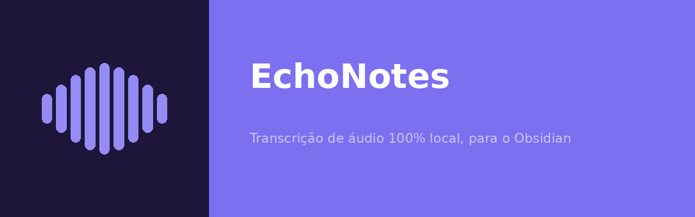

# EchoNotes

App de desktop para **Windows 10+** que escuta todo o áudio que sai do seu
computador (navegador, videoconferência, players, qualquer app), transcreve
em tempo real e, ao final, gera automaticamente uma nota `.md` resumida e
compatível com o **Obsidian**.

100% local e gratuito: a transcrição roda com
[faster-whisper](https://github.com/SYSTRAN/faster-whisper) e o resumo com um
modelo de linguagem pequeno rodando **dentro do próprio app**
(`llama.cpp`/`llama-cpp-python`) — nenhum áudio ou texto é enviado para a
internet, não há custo de API e **não é preciso instalar nada separado**
(nada de instalar Python, Ollama, etc. na versão empacotada).

## Como funciona

1. **Captura**: grava o áudio de saída do Windows em modo *loopback* (WASAPI),
   ou seja, tudo que sai pelo alto-falante/fone — inclui o navegador e
   qualquer outro programa.
2. **Segmentação**: um detector de silêncio (VAD por energia) agrupa o áudio
   em frases/trechos de fala.
3. **Transcrição**: cada trecho é transcrito localmente com faster-whisper
   e aparece na tela em tempo real.
4. **Resumo**: ao clicar em "Parar e salvar", a transcrição completa é
   resumida por um LLM local (Qwen 2.5, quantizado, roda em CPU).
5. **Arquivo final**: um `.md` com front matter YAML (título, data, tags) +
   resumo + transcrição completa com timestamps é salvo na pasta que você
   escolher — aponte direto para uma pasta dentro do seu vault do Obsidian.

Na **primeira execução**, o próprio app baixa o modelo de resumo (~1-2 GB,
com barra de progresso) e o modelo de transcrição Whisper `large-v3-turbo`
(~1,5 GB) — juntos, cerca de 3 GB baixados uma única vez. Depois disso
funciona 100% offline.

## Usando a versão pronta (recomendado)

1. Baixe `EchoNotes.exe` na aba
   [Releases](https://github.com/Aukaii/EchoNotes/releases) deste
   repositório e execute.
2. Na primeira vez, aguarde o download automático dos modelos (tela de
   progresso).
3. Pronto — a interface principal só tem: título da aula, pasta de destino e
   o botão **Iniciar/Parar gravação**. Configurações técnicas (tamanho dos
   modelos, sensibilidade do detector de fala) ficam em "⚙ Configurações".

O app verifica sozinho, periodicamente, se há uma versão nova publicada no
GitHub e mostra um aviso com um botão "Atualizar agora" — que baixa e troca
o `.exe` automaticamente.

> **Aviso sobre o instalador:** como o `.exe` não é assinado digitalmente
> (certificados de assinatura de código são pagos), o Windows SmartScreen ou
> o antivírus podem exibir um aviso na primeira execução de cada versão nova.
> Isso é uma limitação de distribuir um app gratuito sem certificado — não
> tem como evitar sem comprar um certificado de assinatura.

## Rodando a partir do código-fonte (para desenvolvimento)

```powershell
git clone https://github.com/Aukaii/EchoNotes
cd EchoNotes
python -m venv .venv
.venv\Scripts\activate
pip install -r requirements.txt
python run.py
```

Use **Python 3.10+ do python.org** (marque "Add python.exe to PATH" no
instalador). Evite a versão da Microsoft Store: ela costuma vir sem o
Tkinter, usado na interface gráfica. Rodando a partir do código-fonte, a
atualização automática só avisa que há versão nova — a troca de arquivo só
funciona no `.exe` empacotado (use `git pull` para atualizar).

## Gerando o `.exe` você mesmo

Um push de tag `vX.Y.Z` neste repositório dispara o workflow
`.github/workflows/build-windows.yml`, que compila o `.exe` num runner
Windows do GitHub Actions e publica como Release automaticamente (é assim
que o auto-updater encontra novas versões). Para gerar localmente:

```powershell
pip install pyinstaller
pyinstaller --onefile --noconsole --name EchoNotes --icon assets/icon.ico --add-data "assets;assets" --collect-all llama_cpp --collect-all faster_whisper --collect-all scipy run.py
```

O executável fica em `dist/EchoNotes.exe`, já com o ícone da marca embutido.

## Identidade visual

Os arquivos de marca ficam em [`assets/`](assets): `icon.ico`/`icon_mark.png`
(ícone do app), `logo_square.png` (logo quadrado) e `banner.png` (usado no
topo deste README). Para o repositório também mostrar o banner nos links
compartilhados (redes sociais, Slack etc.), suba `assets/banner.png` em
**Settings → General → Social preview** no GitHub — isso só pode ser feito
pela interface web, não existe API para automatizar.

## Solução de problemas

Se a gravação terminar sem nenhuma fala detectada:

1. Durante a gravação, acompanhe o **"Nível de áudio"** na tela principal —
   ele mostra o volume captado em tempo real comparado ao limiar configurado.
   Se o número não se mexer nunca (fica zerado mesmo com o vídeo tocando),
   o problema é a captura do áudio do sistema, não a sensibilidade.
2. Ajuste o **limiar de detecção de fala** em "⚙ Configurações" observando
   esse nível ao vivo — ele mostra o valor numérico exato, não precisa
   adivinhar pela posição do controle deslizante.
3. Se algo der errado silenciosamente (a versão empacotada não tem console
   para mostrar erros), consulte o arquivo de log em
   `~/.echonotes/echonotes.log` — todas as exceções ficam registradas lá.

Se a transcrição sair com palavras completamente desconexas do que foi
dito: isso costuma ser perda real de áudio, não erro de reconhecimento —
a thread de captura (tempo real) pode ficar sem CPU enquanto o Whisper
transcreve um trecho anterior, perdendo pedaços do áudio sem gerar nenhum
erro visível. O log mostra um aviso ("Leitura de áudio demorou...") quando
isso é detectado. O app já reserva CPU para a captura e lê em blocos
maiores para reduzir esse risco; se ainda acontecer, tente um modelo
Whisper menor (`small`/`medium`) em "⚙ Configurações" para dar mais folga.

## Limitações conhecidas

- O VAD por energia é simples (baseado em volume); em áudio com música de
  fundo alta ou volume muito baixo pode cortar frases de forma imprecisa.
  Ajustável em "⚙ Configurações" (limiar de detecção de fala).
- Não há separação de falantes (diarização) — a transcrição não identifica
  "quem" está falando.
- O LLM local de resumo (Qwen 2.5, 1.5B ou 3B) é bem mais limitado que
  modelos como GPT/Claude; a qualidade do resumo reflete isso. É possível
  trocar o tamanho do modelo em "⚙ Configurações".
- O modelo Whisper padrão é o `large-v3-turbo` (melhor precisão em português
  com boa velocidade em CPU). Em computadores mais fracos, troque para
  `small` ou `medium` em "⚙ Configurações" se a transcrição atrasar demais.
  Com GPU NVIDIA, é possível editar `~/.echonotes/config.json` (gerado após
  o primeiro uso) para usar `"whisper_device": "cuda"` e
  `"whisper_compute_type": "float16"`.
- Vídeos/aulas reproduzidos em velocidade acelerada (1.25x-2x) reduzem a
  precisão do Whisper; use o seletor de velocidade na tela principal para
  compensar (o áudio é esticado de volta à velocidade normal antes de
  transcrever — só afeta a transcrição, nunca o que você ouve).
- A atualização automática exige que o Release no GitHub contenha um arquivo
  chamado exatamente `EchoNotes.exe` (é o nome usado pelo workflow).

## Rodando os testes

Os testes cobrem a lógica pura (segmentação de fala e geração do Markdown),
sem depender de hardware de áudio ou dos modelos:

```powershell
pip install pytest
pytest
```
